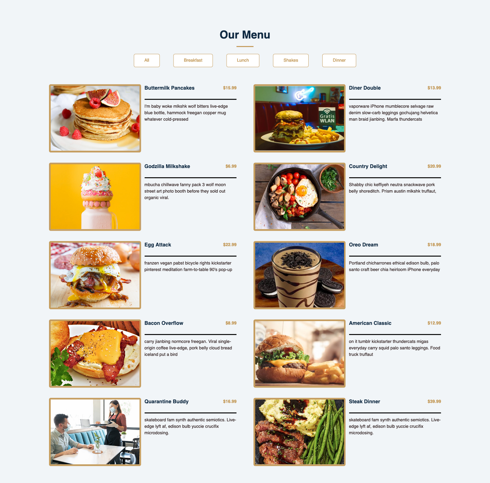

## Restaurant Menu
**Create Responsive Restaurant Menu Page with Html, Css and Javascript**

I learned from this Challenge on [freecodecamp](https://www.freecodecamp.org/news/javascript-projects-for-beginners/#how-to-create-a-restaurant-menu-page) how to make a restaurant menu page that filters through the different food menus.

### Screenshot

### Key concepts covered:
- arrays
- objects
- forEach()
- DOMContentLoaded
- map, reduce, and filter
- innerHTML
- includes method
